<div align="center">

<picture>
  <source media="(prefers-color-scheme: dark)" srcset="docs/readme/kunye-koyu.svg">
  
</picture>

<br>

[](pyproject.toml)
[](LICENSE)
[](docs/rehber/LICENSE)
[](docs/rehber/index.md)
[](#gizlilik)
[](#görsel-dil-düzeltmen-masası)

**[Kurulum](#kurulum)** &nbsp;·&nbsp; **[Kullanım](#kullanım)** &nbsp;·&nbsp; **[Kurallar](#kurallar)** &nbsp;·&nbsp; **[Skorlar](#skorlar)** &nbsp;·&nbsp; **[Görsel dil](#görsel-dil-düzeltmen-masası)** &nbsp;·&nbsp; **[Belgeler](#belgeler)**

</div>

<br>

**kolaymetin, kamu duyurularını zihinsel engelli bireyler, yaşlılar ve okumakta zorlanan herkes
için anlaşılır hâle getirmenize yardım eder.** Metninizi cümle ve kelime düzeyinde inceler; uzun
cümleleri, edilgen yapıları, resmî ve yabancı kelimeleri, belirsiz ifadeleri ve biçim sorunlarını
işaretler. Her işaret için **nedenini** ve **somut bir öneri** yazar.

Belediye basın birimleri, engelli dernekleri ve çevirmenler için tasarlandı. Tamamen çevrimdışı
çalışır: metniniz bilgisayarınızdan hiç çıkmaz.

> [!IMPORTANT]
> Bu araç bir **yardımcıdır**, hakem değildir. Bir Kolay Dil metnini ancak hedef okurlar
> doğrulayabilir. Metni her zaman hedef okurlarla test edin.

<picture>
  <source media="(prefers-color-scheme: dark)" srcset="docs/readme/ayirici-koyu.svg">
  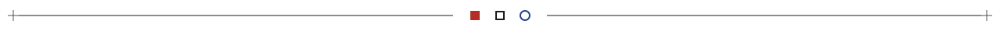
</picture>

## Bir cümle, baştan sona

<picture>
  <source media="(prefers-color-scheme: dark)" srcset="docs/readme/prova-koyu.svg">
  
</picture>

Bürokratik cümle:

> Müracaatların 01.12.2026 tarihinden itibaren ivedilikle yapılması gerekmektedir.

kolaymetin'in bulduğu sorunlar (hepsi **uyarı**, yani fosforlu kalem):

| | Kural | Bulgu | Öneri |
|:-:|---|---|---|
| □ | `KD-K01` | "Müracaat", "itibaren", "ivedilikle" resmî ve eski ifadeler | başvuru, … başlayarak, hemen |
| □ | `KD-B04` | "01.12.2026" tarihi rakamla yazılmış | 1 Aralık 2026 Salı |
| □ | `KD-C03` | Bu cümlede işi kimin yaptığı belli değil | Yapanı söyleyin |
| □ | `KD-C07` | Eylem isme dönüşmüş ("yapılması gerekmektedir") | Fiili doğrudan kullanın |
| □ | `KD-C11` | Cümle okura doğrudan seslenmiyor | "… yapın" diye seslenin |

Kolay Dil hâli:

> Başvurular 1 Aralık 2026 Salı günü başlıyor.<br>
> Başvurunuzu hemen yapın.

| | Önce | Sonra |
|---|:-:|:-:|
| **Kolay Dil Uyum Skoru** | `1` | `100` |
| Ateşman okunabilirlik | `−43,3` | `61,2` |
| Bulgu | `7` | `0` |

## Tanıtım filmi

<div align="center">

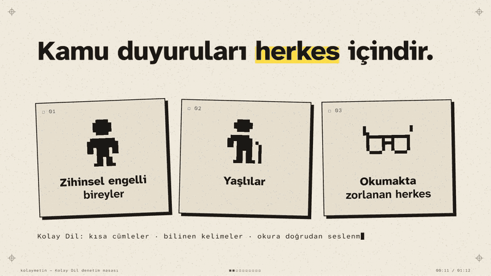

<sub>72 saniyelik filmin tamamı: <a href="docs/readme/kolaymetin-tanitim.mp4"><b>kolaymetin-tanitim.mp4</b></a> &nbsp;·&nbsp; filmin kaynağı ve betikleri: <a href="tanitim/"><code>tanitim/</code></a></sub>

</div>

## Ekranlar

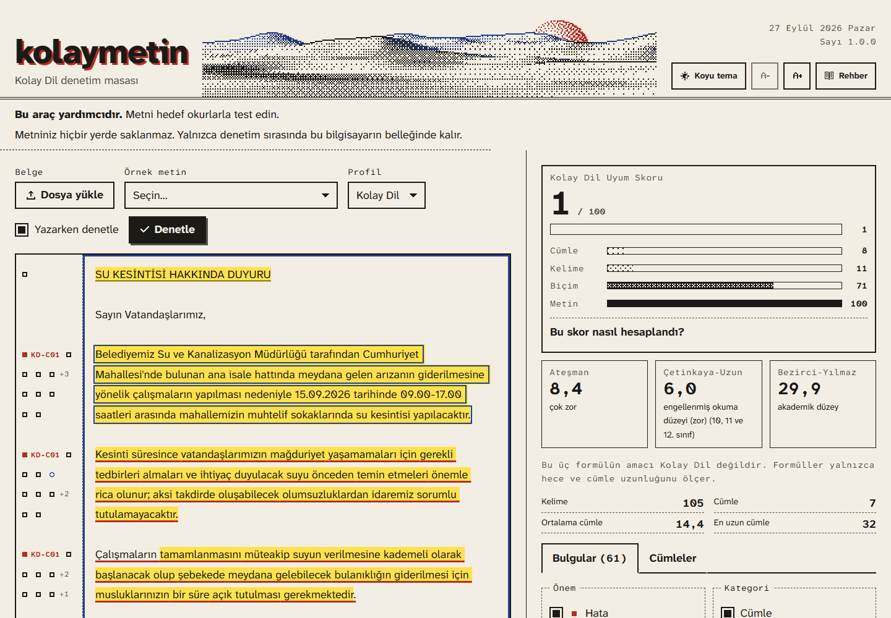

| Boş masa | Koyu tema: negatif baskı | Telefon (375 px) |
|:-:|:-:|:-:|
| 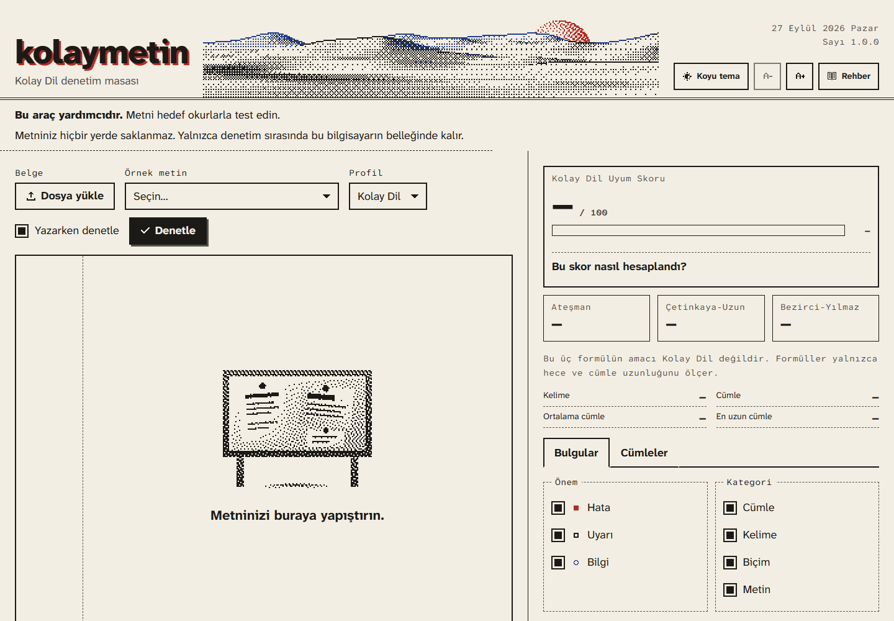 | 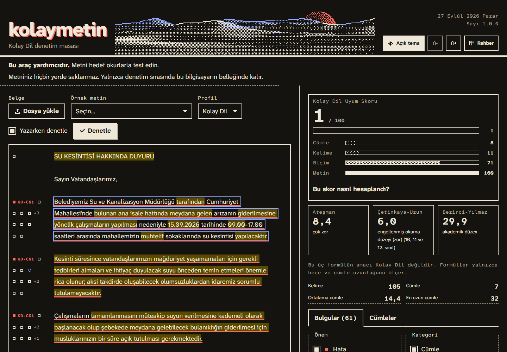 | 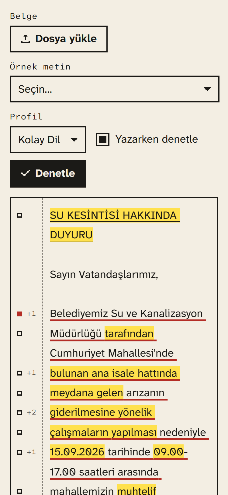 |
| **Yazdırılabilir rapor** | **Kural rehberi** | **Gri tonlu çıktı** |
| 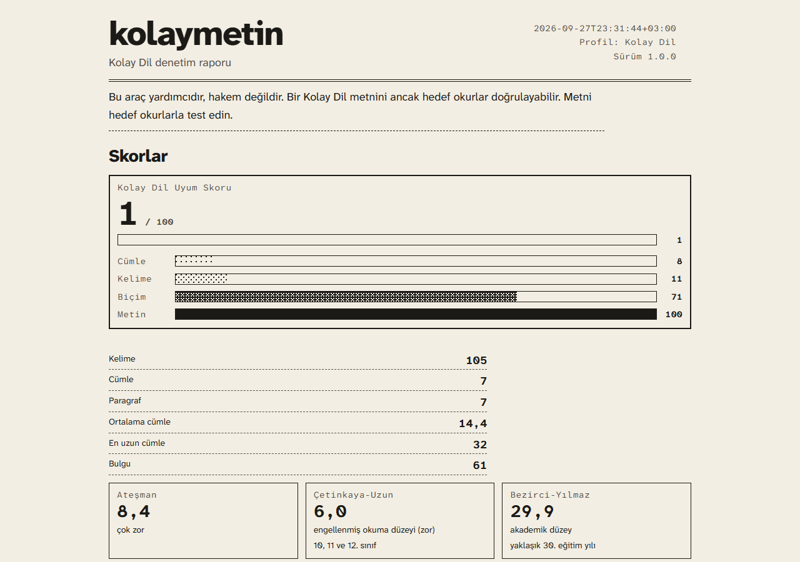 | 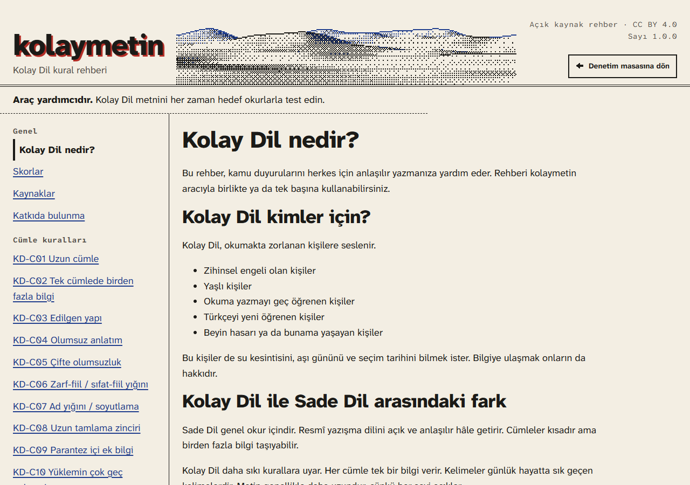 | 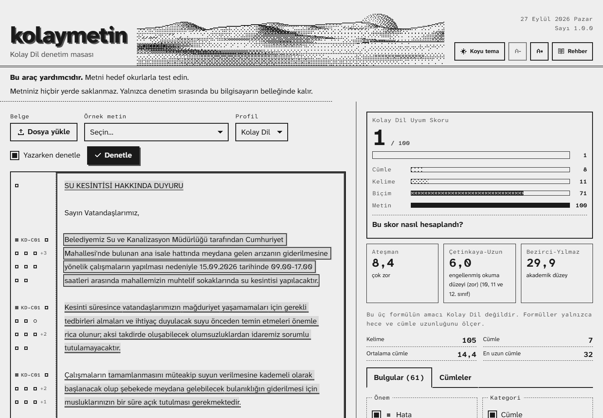 |

<picture>
  <source media="(prefers-color-scheme: dark)" srcset="docs/readme/ayirici-koyu.svg">
  
</picture>

## Kurulum

### En kolay yol: Docker

Docker kurulu bir bilgisayarda proje klasöründe şu komutu çalıştırın:

```bash
docker compose up
```

Sonra tarayıcıda şu adresi açın: <http://localhost:8000>

> [!TIP]
> Varsayılan ayar yalnızca bu bilgisayardan erişime izin verir. Belediye ağındaki başka
> bilgisayarlar da kullanacaksa `docker-compose.yml` içindeki `127.0.0.1:8000:8000` satırını
> `8000:8000` yapın.

### pipx ile

```bash
pipx install .
```

```bash
kolaymetin sunucu
```

### Geliştirici kurulumu

```bash
uv venv --python 3.12
uv pip install -e ".[dev]"
```

`uv` yoksa `python -m venv .venv` ve `.venv/bin/pip install -e ".[dev]"` kullanın.
Python 3.11 ya da daha yeni bir sürüm gerekir.

## Kullanım

Üç yoldan kullanılır. Üçü de aynı `analyze()` işlevini çağırır.

<table>
<tr>
<th width="33%">■ Web arayüzü</th>
<th width="33%">□ Komut satırı</th>
<th width="33%">○ Python kütüphanesi</th>
</tr>
<tr>
<td valign="top">

```bash
kolaymetin sunucu
```

Metni yapıştırın ya da `.txt`, `.docx`, `.pdf` dosyası bırakın.

</td>
<td valign="top">

```bash
kolaymetin denetle duyuru.docx
```

Renkli özet; `md`, `html`, `json` rapor.

</td>
<td valign="top">

```python
from kolaymetin import analyze
analyze("Başvurular alınacaktır.")
```

Bulgular, skorlar, dışa aktarma.

</td>
</tr>
</table>

### Web arayüzü

```bash
kolaymetin sunucu --port 8000
```

- Metni sol taraftaki alana yapıştırın ya da `.txt`, `.docx`, `.pdf` dosyası sürükleyip bırakın.
- "Örnek metin" menüsünde kurgusal belediye duyuruları var.
- Profil: **Kolay Dil** (en sıkı) ya da **Sade Dil** (genel okur).
- Araç yazarken 600 ms bekleyip kendiliğinden denetler. İsterseniz "Denetle" düğmesine basın.
- İşaretli bir yere tıklayın: ilgili not kartı açılır. Kartta "Neden? → rehber", "Metinde göster" ve
  "Yoksay" seçenekleri var.
- "Cümleler" sekmesi her cümlenin uzunluğunu bir çubukla gösterir.
- Raporu HTML (yazdırılabilir; tarayıcıdan "PDF olarak kaydet"), Markdown ya da JSON olarak indirin.
- Klavyeyle tam kullanılır; açık/koyu tema ve yazı büyütme düğmeleri var.

### Komut satırı

```bash
kolaymetin denetle tests/corpus/su-kesintisi-burokratik/metin.txt
```

<details>
<summary><b>Daha fazla örnek:</b> rapor dosyası, profil, CI eşiği</summary>

<br>

```bash
kolaymetin denetle tests/corpus/su-kesintisi-burokratik/metin.txt --cikti md -o rapor.md
```

```bash
kolaymetin denetle tests/corpus/su-kesintisi-kolay/metin.txt --profil sade-dil --cikti html -o rapor.html
```

```bash
kolaymetin denetle tests/corpus/su-kesintisi-kolay/metin.txt --esik-skor 70
```

```bash
kolaymetin kurallar
```

```bash
kolaymetin surum
```

</details>

Girdi `.txt`, `.md`, `.docx`, `.pdf` ya da `-` (standart girdi) olabilir. Çıkış kodları:

| Kod | Anlamı |
|:-:|---|
| `0` | başarılı |
| `1` | uyum skoru `--esik-skor` değerinin altında (CI için) |
| `2` | girdi hatası |

### Kütüphane

```python
from kolaymetin import analyze

report = analyze("Başvurular alınacaktır.", profile="kolay-dil")
print(report.scores.compliance.value, report.scores.atesman.value)
for f in report.findings:
    print(f.rule_id, f.severity, f.message, f.suggestion)

report.to_json()
report.to_markdown()
report.to_html()
```

`print(report)` kısa bir özet yazar. Boş metin `kolaymetin.api.EmptyInput` hatası verir.

> [!NOTE]
> Windows'ta çıktıyı bir dosyaya ya da başka bir programa yönlendiriyorsanız (`> rapor.txt`,
> `| more`) Python, Türkçe kod sayfasını (cp1254) kullanır. Önerilerdeki "→" gibi karakterler bu
> kod sayfasında yoktur. `PYTHONUTF8=1` ortam değişkenini ayarlayın. `kolaymetin` komutu bunu
> kendisi yapar.

## Belediyeler için: kendi profilinizi ve sözlüğünüzü ekleyin

### 1. Profil

Yeni bir dosya oluşturun, örneğin `yesilova.yaml`. Yalnızca değiştirmek istediğiniz kuralları yazın:

```yaml
name: yesilova
extends: kolay-dil          # kolay-dil ya da sade-dil üzerine kur
compliance_k: 0.6
rules:
  KD-C01: {params: {warn_above: 12, error_above: 18}}   # cümle eşikleri (varsayılan: 10 / 15)
  KD-K06: {enabled: false}                              # seyrek kelime kuralını kapat
  KD-C04: {severity: bilgi}                             # olumsuz anlatım yalnızca bilgi versin
```

`extends` başka bir profil dosyası da olabilir: `extends: taban.yaml`. Araç bu dosyayı önce
profilin kendi klasöründe, sonra çalışma klasöründe arar.

### 2. Sözlük

Belediyenize özgü resmî kelimeleri `ek-sozluk.yaml` dosyasına yazın:

```yaml
jargon:
  - {ifade: encümen, oneri: "belediye kurulu"}
  - {ifade: zabıta memuru, oneri: "belediye görevlisi (zabıta)"}
kisaltmalar:
  - {kisaltma: YBB, acilim: Yeşilova Büyükşehir Belediyesi}
bilinen: [yeşilovalı]         # uzun ama herkesin bildiği kelimeler
sik_kelimeler: [imece]         # temel kelime listesine ekler
es_anlamlilar:
  - {grup: [otobüs durağı, durak yeri], tercih: otobüs durağı}
deyimler:
  # iki_anlamli: gerçek anlamıyla da sık geçer, araç yalnızca bilgi verir.
  # gercek: cümlede bu kelimelerle başlayan bir kelime varsa deyim gerçek anlamdadır.
  - {ifade: yola çıkmak, anlam: başlamak, iki_anlamli: true, gercek: [otobüs, tren]}
```

Geçerli bölümler: `jargon`, `yabanci`, `deyimler`, `belirsiz`, `kisaltmalar`, `es_anlamlilar`,
`dolayli_hitap`, `sik_kelimeler`, `bilinen`.

### 3. Çalıştırın

```bash
kolaymetin denetle duyuru.docx --profil yesilova.yaml --sozluk ek-sozluk.yaml
```

Web arayüzünde yalnızca yerleşik profiller seçilebilir; ek sözlük `POST /api/analyze` isteğinin
`custom_lexicon` alanıyla (YAML metni) gönderilebilir.

### Satır içi susturma

Bir paragrafta bir kuralı bilerek çiğniyorsanız paragrafın başına şu yorumu yazın:

```
<!-- kolaymetin: yoksay KD-K01 -->
```

Kural kimliği yazmazsanız o paragraftaki bütün kurallar susar.

<picture>
  <source media="(prefers-color-scheme: dark)" srcset="docs/readme/ayirici-koyu.svg">
  
</picture>

## Kurallar

<picture>
  <source media="(prefers-color-scheme: dark)" srcset="docs/readme/kurallar-koyu.svg">
  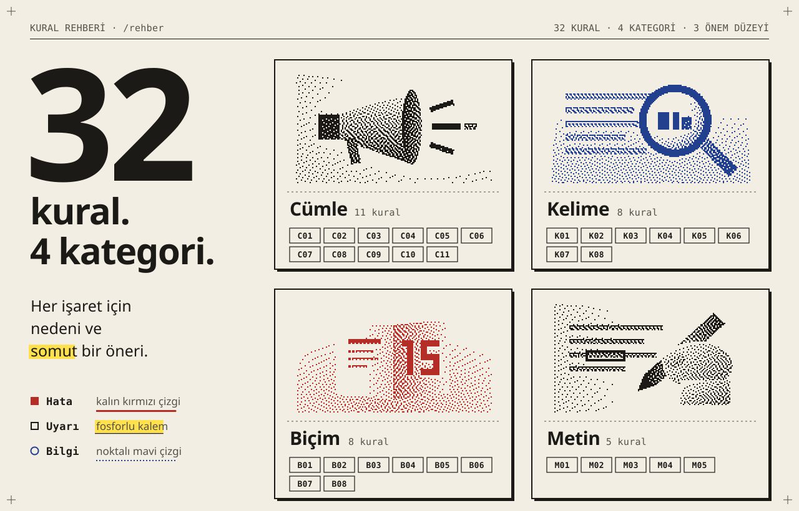
</picture>

32 kural dört kategoride toplanır. Her birinin [rehberde](docs/rehber/index.md) bir sayfası var
(web: `/rehber/KD-C01` …).

| Kategori | Kurallar |
|---|---|
| **Cümle** | [KD-C01](docs/rehber/KD-C01.md) uzun cümle · [C02](docs/rehber/KD-C02.md) birden fazla bilgi · [C03](docs/rehber/KD-C03.md) edilgen yapı · [C04](docs/rehber/KD-C04.md) olumsuz anlatım · [C05](docs/rehber/KD-C05.md) çifte olumsuzluk · [C06](docs/rehber/KD-C06.md) zarf-fiil yığını · [C07](docs/rehber/KD-C07.md) ad yığını · [C08](docs/rehber/KD-C08.md) tamlama zinciri · [C09](docs/rehber/KD-C09.md) parantez · [C10](docs/rehber/KD-C10.md) geç yüklem · [C11](docs/rehber/KD-C11.md) dolaylı hitap |
| **Kelime** | [KD-K01](docs/rehber/KD-K01.md) jargon · [K02](docs/rehber/KD-K02.md) yabancı kelime · [K03](docs/rehber/KD-K03.md) kısaltma · [K04](docs/rehber/KD-K04.md) uzun kelime · [K05](docs/rehber/KD-K05.md) deyim · [K06](docs/rehber/KD-K06.md) seyrek kelime · [K07](docs/rehber/KD-K07.md) belirsiz ifade · [K08](docs/rehber/KD-K08.md) terim tutarsızlığı |
| **Biçim** | [KD-B01](docs/rehber/KD-B01.md) yazıyla sayı · [B02](docs/rehber/KD-B02.md) Roma rakamı · [B03](docs/rehber/KD-B03.md) yüzde/kesir · [B04](docs/rehber/KD-B04.md) tarih · [B05](docs/rehber/KD-B05.md) saat · [B06](docs/rehber/KD-B06.md) noktalı virgül · [B07](docs/rehber/KD-B07.md) büyük harf · [B08](docs/rehber/KD-B08.md) tırnak |
| **Metin** | [KD-M01](docs/rehber/KD-M01.md) uzun paragraf · [M02](docs/rehber/KD-M02.md) başlık yok · [M03](docs/rehber/KD-M03.md) liste fırsatı · [M04](docs/rehber/KD-M04.md) önemli bilgi sonda · [M05](docs/rehber/KD-M05.md) uzun metin |

## Skorlar

- **Kolay Dil Uyum Skoru (0–100):** kurallara dayanır; `100 × e^(−k × ceza / cümle sayısı)`.
  Arayüzdeki "Bu skor nasıl hesaplandı?" paneli her kuralın katkısını gösterir.
- **Ateşman (1997)**, **Çetinkaya-Uzun (2010)**, **Bezirci-Yılmaz (2010)**: Türkçe okunabilirlik
  formülleri. Formüller ve kaynaklar: [docs/rehber/skorlar.md](docs/rehber/skorlar.md).

## Nasıl çalışır

<picture>
  <source media="(prefers-color-scheme: dark)" srcset="docs/readme/hat-koyu.svg">
  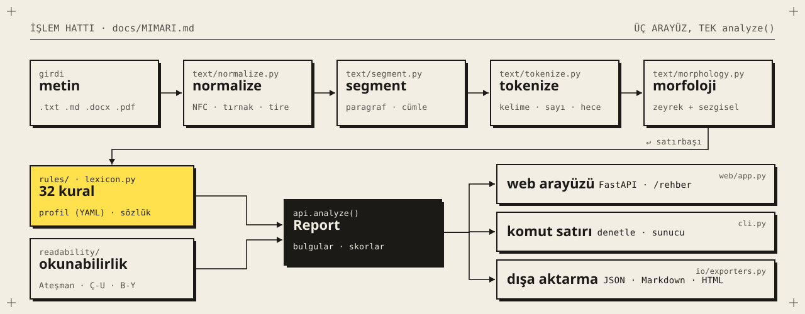
</picture>

Ayrıntılar: [docs/MIMARI.md](docs/MIMARI.md) ve [docs/KARARLAR.md](docs/KARARLAR.md).

<picture>
  <source media="(prefers-color-scheme: dark)" srcset="docs/readme/ayirici-koyu.svg">
  
</picture>

## Görsel dil: "Düzeltmen Masası"

Arayüz, küçük bir matbaanın düzeltme provası gibi görünür: krem risograf kâğıdı, siyah mürekkep,
iki nokta renk (kırmızı ve mavi) ve fosforlu kalem. Bulgular düzeltmen işaretleriyle gösterilir;
her önem düzeyinin rengi, çizgi biçimi ve kenar işareti ayrıdır, bu yüzden siyah-beyaz çıktıda da
ayırt edilir:

| Önem | Metin üstünde | Kenarda |
|---|---|:-:|
| **Hata** | kalın düz kırmızı alt çizgi | ■ + kural kimliği |
| **Uyarı** | sarı fosforlu kalem + ince çizgi | □ |
| **Bilgi** | noktalı mavi alt çizgi | ○ |

<picture>
  <source media="(prefers-color-scheme: dark)" srcset="docs/readme/renkler-koyu.svg">
  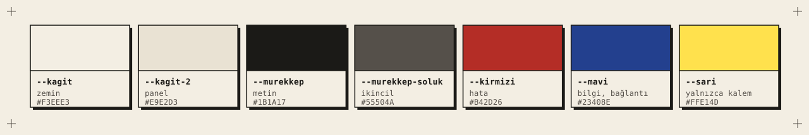
</picture>

<sub>Renkler yalnızca <code>style.css</code> içindeki <code>:root</code> değişkenlerinden gelir. GitHub koyu temadaysa yukarıda koyu temanın "negatif baskı" renklerini görürsünüz.</sub>

- Tek yazı tipi ailesi: **Atkinson Hyperlegible** Next ve Mono (Braille Institute, SIL OFL).
- Köşeler keskin; gölge yok (yalnızca düz, 3px ofset baskı gölgesi); gradyan yok.
- Görseller 1-bit dither: künyedeki güneş ve tepeler, skor çubukları, boş durum çizimi, rehber
  kapakları, yükleme göstergesi. Metnin arkasına asla dither konmaz.
- İkonlar 16×16 piksel ızgarada, yalnızca dikdörtgenlerden oluşan SVG'lerdir.
- Bütün parçalar tek sayfada: `/stil-rehberi` ([src/kolaymetin/web/static/stil-rehberi.html](src/kolaymetin/web/static/stil-rehberi.html)).

<details>
<summary><b>Stil rehberinin tamamı</b> (uzun görsel)</summary>

<br>

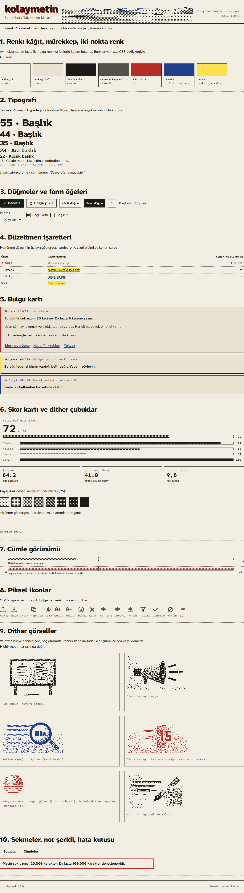

</details>

### Kendi görselinizi dither'layın

Kaynak SVG'ler `assets/kaynak/` klasöründedir. Kendi gri tonlu görselinizi (PNG, JPG ya da SVG)
1-bit görsele çevirmek için:

```bash
python scripts/dither.py assets/kaynak/megafon.svg benim-gorselim.png --yontem atkinson --genislik 160
```

Yöntemler: `atkinson` (hata yayma), `bayer4`, `bayer8` (sıralı dither). Çıktı şeffaf zeminli ve
yalnızca siyah piksellidir; renk CSS'ten (`mask-image`) gelir. Projedeki bütün görselleri ve
desenleri yeniden üretmek için:

```bash
python scripts/dither.py --hepsi
```

Renk kontrastını denetlemek için:

```bash
python scripts/kontrast_denetle.py
```

Bu README'deki görseller de aynı renklerle, aynı yazı tipleriyle ve aynı dither görsellerle
basılır; açık ve koyu tema için ayrı ayrı:

```bash
python scripts/readme_gorselleri.py
```

<details>
<summary><b>Görsel öz değerlendirme</b> (Bölüm 9.4.11)</summary>

<br>

`docs/ekran/` içindeki görüntülere göre:

- [x] Ekran basılı bir düzeltme provası gibi görünüyor; kontrol paneli gibi değil.
- [x] Üç önem düzeyi gri tonlu görüntüde de çizgi biçimi ve kenar işaretinden ayırt ediliyor ([gri-tonlu.png](docs/ekran/gri-tonlu.png)).
- [x] Dither yalnızca künye sahnesinde, skor çubuklarında, boş durumda, rehber kapaklarında ve yüklemede.
- [x] Tek yazı tipi ailesi; hiyerarşi boyut ve kalınlıkla kurulu.
- [x] Köşeler keskin, gölgeler yalnızca düz ofset.

</details>

## Sınırlılıklar

> [!WARNING]
> **Araç hedef kitle testinin yerini tutmaz.** Kolay Dil metinlerini okurlarla test edin.
> Kolay Dil metnini standart metnin **yanında** yayımlayın, yerine değil.

- **Okunabilirlik formülleri Kolay Dil için tasarlanmadı.** Yalnızca hece ve cümle uzunluğunu
  ölçer; kelimenin tanıdık olup olmadığını ve anlamı ölçmez.
- **Morfolojik belirsizlik:** Türkçede bir kelimenin birden fazla çözümlemesi olabilir
  ("yıkandı" dönüşlü mü, edilgen mi?). Araç emin olmadığı bulgularda güveni düşürür ve
  çoğu zaman yalnızca "bilgi" verir. zeyrek sözlüğünde olmayan kelimeler için sezgisel çözümleme
  kullanılır.
- **Temel kelime listesi** (KD-K06) katkıcılar tarafından derlendi; bir sıklık derleminden
  gelmiyor. Bu yüzden kural yalnızca bilgi verir.
- zeyrek sözlüğünün ilk yüklenmesi birkaç saniye sürer; sonraki denetimler hızlıdır
  (5.000 kelime yaklaşık 1–2 saniye).
- Taranmış (resim) PDF'lerden metin çıkarılamaz.

## Gizlilik

> [!NOTE]
> Metin hiçbir yerde saklanmaz; yalnızca denetim sırasında bellekte kalır ve günlüğe yazılmaz.

- Hiçbir dış servise bağlantı kurulmaz: telemetri, analitik, CDN, dış yazı tipi yok.
- Testler dış bağlantıları engelleyerek bunu doğrular.

## Belgeler

| Belge | İçerik |
|---|---|
| [Kural rehberi](docs/rehber/index.md) | her kuralın açıklaması, örnekleri ve kaynakları (web: `/rehber`) |
| [Mimari](docs/MIMARI.md) | işlem hattı, ofsetler, kural motoru |
| [Kararlar](docs/KARARLAR.md) | tasarım kararları ve gerekçeleri |
| [Katkıda bulunma](CONTRIBUTING.md) | geliştirme ortamı, testler, yeni kural ekleme |
| [Değişiklik günlüğü](CHANGELOG.md) | sürümler ve düzeltmeler |

## Kaynaklar ve teşekkür

- Demirkıvıran, S. ve Göktepe, F. (2025). *Kolay Dilin Temelleri ve Türkçe Kolay Dilin İlkeleri*. Ankara: Aile ve Sosyal Hizmetler Bakanlığı Yayınları (TÜBİTAK 123K021).
- Göktepe, F. ve Demirkıvıran, S. (2024). Türkçe Kolay Dil'e İlk Yaklaşımlar. *Türk Kültürü İncelemeleri Dergisi*, 51, 297–332. doi:10.24058/tki.2024.509
- Şengel, Z. ve Okyayuz, A. Ş. (2025). Bilgiyi Erişilebilir Kılmak: Kolay Dil ve Sade Dil Arasındaki Etkileşim. *Çeviribilim ve Uygulamaları Dergisi*, 38, 88–107. doi:10.37599/ceviri.1654261
- Netzwerk Leichte Sprache (2009/2022). *Die Regeln für Leichte Sprache*.
- Inclusion Europe. *Information for all*.
- ISO 24495-1:2023. *Plain language — Part 1*.
- Ateşman (1997); Çetinkaya (2010); Bezirci ve Yılmaz (2010).
- Türkçe Kolay Dil Kütüphanesi: [www.kolaydil.tr](https://www.kolaydil.tr)
- [zeyrek](https://github.com/obulat/zeyrek) (Zemberek-NLP'nin Python sürümü) ve Atkinson Hyperlegible yazı tipi.

Türkçe Kolay Dil ilkelerini yayımlayan araştırmacılara, Kolay Dil metinlerini test eden
okurlara ve engelli derneklerine teşekkür ederiz.

## Lisanslar

| Ne | Lisans |
|---|---|
| Kod | [Apache-2.0](LICENSE) |
| Kural rehberi ve sözlük verileri | [CC BY 4.0](docs/rehber/LICENSE) |
| Yazı tipleri (`src/kolaymetin/web/static/fonts/`) | SIL Open Font License 1.1 |

<br>

<picture>
  <source media="(prefers-color-scheme: dark)" srcset="docs/readme/kapanis-koyu.svg">
  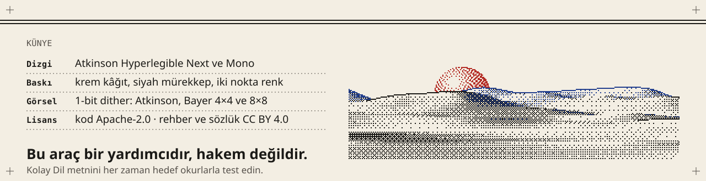
</picture>
